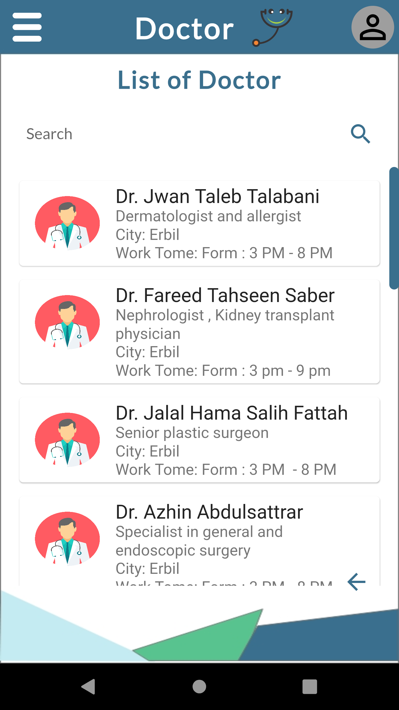
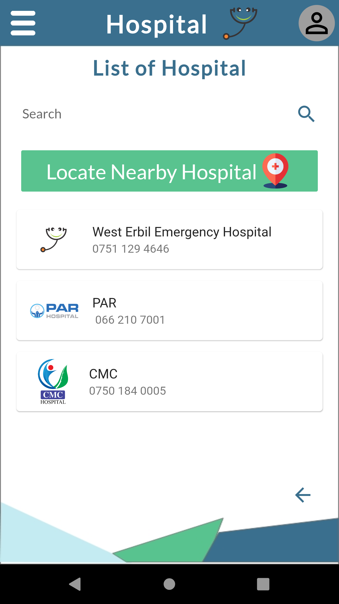
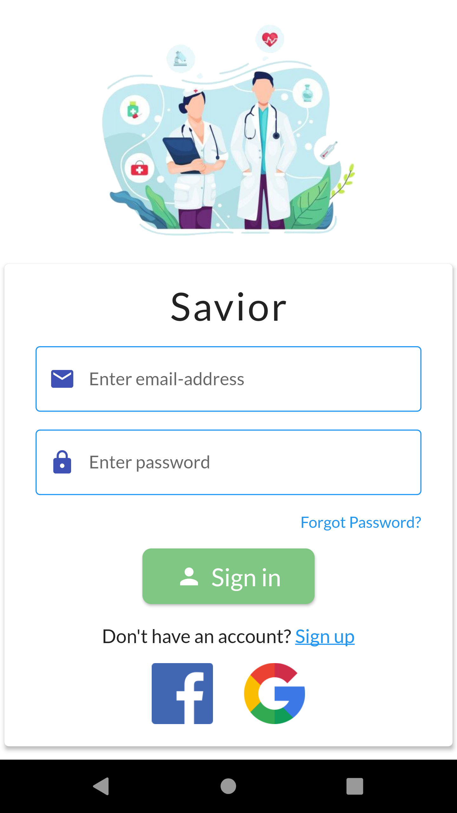
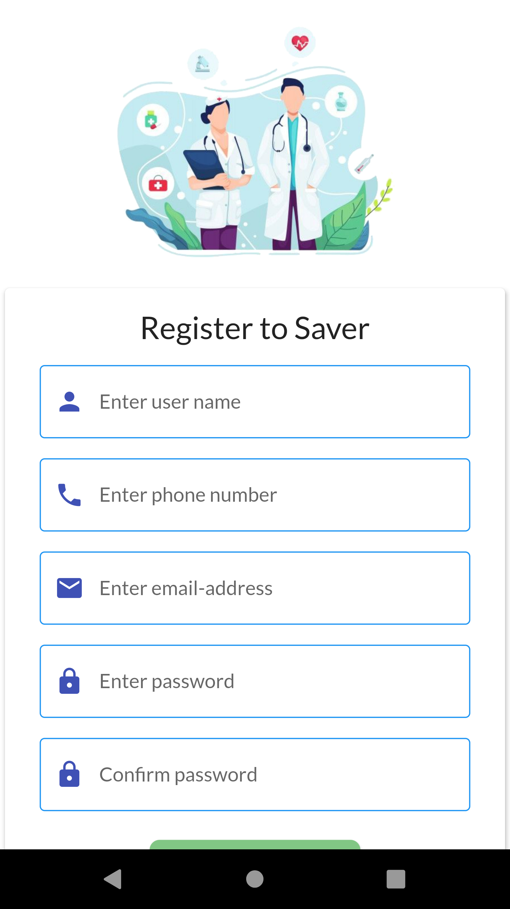
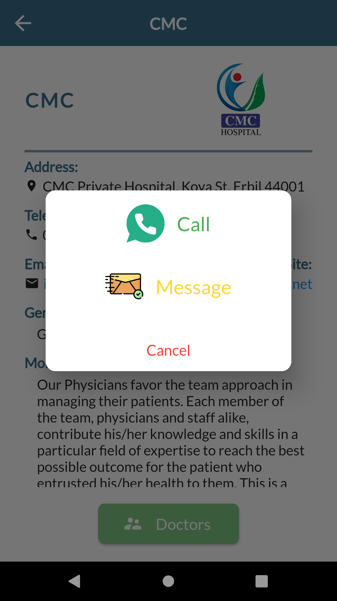

# Savior <!-- -->

Easiest way to manage your health, medicines, emergencies all in one place.

## Download the App

 

## About

The app shows nearby hospitals,  an option to alert emergency contacts, sos button for fetching the number of nearby hospital in case of emergency, and alert emergency contacts regarding the same. Find the companion app here : [Savior Companion](https://github.com/Muhammadbarznji/testapp/tree/master) app.

## Features

- Locate nearby Hospitals
  - This feature help in locating all your nearby hospitals in your current location providing information on the distances and directions for you.

## Technologies Used
- Firebase - Authentication,Firestore,Storage
- TomTom API - Routing and Navigation
- OpenCage API - Location information

## Screenshots

### User Home Screen

### Admin Home Screen

### About Us

### App Drawer

### List of Doctors

### Doctor Info

### List of First Aid

### First Aid

### List of Hospital

### Hospital Info

### Locate Nearby Hospital

### Emergency

### Login

### Sign Up

### User Profile

### Add Doctor

### Add Hospital

### List of Doctors

### Managment Users

### no Internet connection

### Not found Data

### alert message

### Contact Message

## How to Run Code
Clone or download the repo and place it anywhere in your computer. Open the folder in Android Studio or VS Code. Make sure that you have flutter SDK already installed. Type the command in terminal:

"flutter pub get"

After the command is run successfully you can run the app on real device or on emulator by pressing the Play button in Android Studio or by pressing F5 in VS Code.

## Permissions

On Android versions prior to Android 6.0, Savior requires the following permissions:

- Full Network Access: It uses the network data for the firebase.

- Message: Permission required for alerting relatives and to contact hospitals.

- Access Current Location: Current location access required for informing the point of contact.

- Storage: For uploading PDF file.

## Contributing

Any contributions are welcome. Here are a few ways you can help:
 * [Report bugs and make suggestions.](https://github.com/Muhammadbarznji/testapp/issues)

## Credits

<!--Thanks to  Wanicon (https://flaticon.com/authors/wanicon) for the app icon.-->

## License

This application is released under GNU GPLv3 (see [LICENSE](LICENSE)).
Some of the used libraries are released under different licenses.
